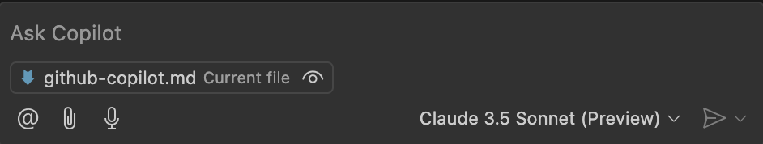
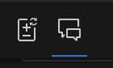

# Github Copilot Tutorial

## Navigation
- [Home](../index.md)
- [Contributing](../contributing.md)

## Overview
This is a nontechnical tutorial of how to use Github Copilot

## Installation
If you don't have an github account, go to [github.com](https://github.com) and create an account. Then go to [education.github.com](https://education.github.com) and follow the signup steps. You will need a school verified email. Then go through the registration process and you are signed up for github copilot! This may take a bit to verify. For students this is absolutely free to use. You can use copilot within multiple forums, including Github, multiple IDE's, and Windows Terminal. It is however mostly used within an IDE. Check [here](https://docs.github.com/en/copilot/using-github-copilot/getting-code-suggestions-in-your-ide-with-github-copilot) for a list of IDE's Copilot works with and even how to start using them. But in general you can add it as an extension or plugin and then signin. You will have to make sure you have an up-to-date version of your IDE that supports the extension/plugin as well.

### Basic Features
1. **Code Completion**
   - Inline suggestions as you type
   - Tab to accept suggestions
   - Use `Alt + ]` or `Alt + [` to cycle through suggestions

2. **Chat Panel**
   - Access via `/` in code
   - Or click Copilot icon in sidebar
   - Ask questions about code
   - Get explanations and examples

3. **Keyboard Shortcuts**
   - `Ctrl + Enter`: Open Copilot completions panel
   - `Esc`: Dismiss suggestion
   - `Tab`: Accept suggestion
   - `Cmd + I` (Mac): Inline chat

## Some tips while using copilot
This tutorial is mainly with the VSCode since that is the most popular IDE. On the bottom right of the IDE you should see the icon for copilot next to the bell as depicted in the image.
 Click on this button. The three most important buttons are "Github Copilot Chat", "Open Completions Panel", and "Settings". 

### Github Copilot Chat
Use the chat feature to ask Copilot any questions about your code. Key features:
- Attach files via paperclip icon
- Select different AI models from dropdown
- Access chat via keyboard shortcut `Cmd + I` (Mac)

#### Chat vs Edit Mode
1. **Chat Mode**: Get explanations and suggestions
2. **Edit Mode**: Direct code modifications
   - Access via blue icon at top left
   - Attach files to modify
   - Review and accept/reject changes

### Open Completions Panel
Access inline code suggestions:
- Open with `Ctrl + Enter`
- Navigate suggestions with `Alt + [` and `Alt + ]`
- Accept with `Tab`
- Dismiss with `Esc`

### Settings
Access settings via:
1. Command Palette (`Cmd + Shift + P`)
2. Type "Copilot Settings"

Key settings:
- Enable/disable suggestions
- Auto-trigger delay
- Language support
- Experimental features

## Troubleshooting
- Check activation status in VSCode
- Verify student access is active
- Clear credentials if needed
- Check [status page](https://status.github.com)

## Conclusion
That's it! You are now ready to use Github Copilot. The more you use it, the better it gets at predicting what you want. It is a very powerful tool that can save you a lot of time. It is also very useful for learning new technologies, as you can simply ask Copilot to explain things to you. If you have any questions, feel free to ask in the chat feature. Happy coding! Also feel free to reference the [documentation](https://docs.github.com/en/copilot).